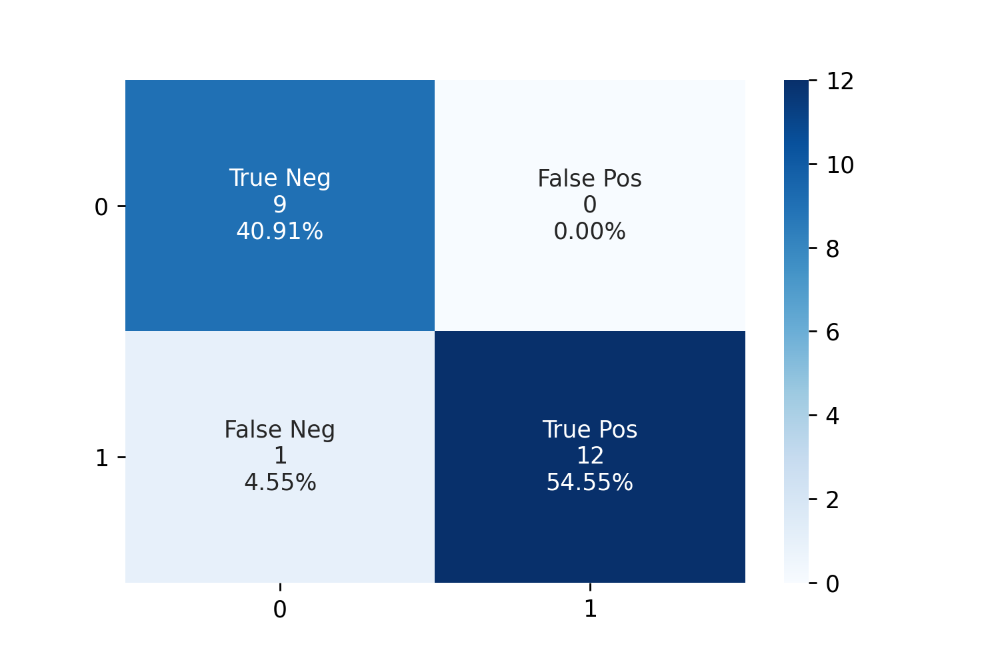

# Intelligent-Placer

Краткое описание лабораторной "Intelligent-Placer" по курсу "Обработатка и интерпретация сигналов".
____
## **Краткое описание**

На вход алгоритму поступает фотография ровной темной горизонтальной поверхности с расположенными на ней двумя белыми листами бумаги; на одном листе черным маркером нарисован многоугольник, а на поверхности второго лежит некоторое количество различных предметов, чья природа заранее обговорена (все потенциально пристутствующие на изображении предметы и горизонтальная поверхность заранее известны и находятся в папке objects). Требуется определить, можно ли одновременно расположить все присутствующие на изображении предметы на плоскости так, чтобы они влезли в нарисованный многоугольник.
____
## **Требования к входу**

### **Изображение и съемка**

- Листы бумаги полностью попадают в кадр и не налагаются друг на друга.

- Лист с контуром многогранника находится сверху, лист с предметами - снизу.

- Разрешение подаваемых на вход фотографий: 3042 на 4032.

- Высота съемки: 40 см

- Угол наклона камеры: до 5 градусов (во избежание сильного искажения контуров присутствующих предметов)

- Освещение в помещении, в котором производится съемка, по возможности равномерно (с целью предотвращения возникновения сильных теней и бликов); фотографирующий аппарат не создает тень на фотографии.

### **Поверхность**

- Поверхность является ровной и темной (то есть не сливается с листами).

### **Предметы**

- Все предметы на изображении попарно различны.

- Каждый из предметов, в случае, если он находится на изображении, представлен в единственном экземпляре.

- Предметы имеют четко выраженные контуры и не сливаются с листом, на котором они лежат.

- Предметы лежат строго внутри контуров листа.

- Предметы не пересекаются друг с другом.

### **Многоугольник**

- Многоугольник задан замкнутым ломаным контуром, нарисованным темным маркером на белом листе бумаги.

___
## **Выход алгоритма**

- Алгоритм выводит изначально поданную на вход фотографию, на которой отмечены распознанные предметы с указанием (в заголовке), можно ли поместить их в нарисованный многоугольник. В случае, если алгоритм выдает утвердительный ответ, внутри многоугольника также отрисовывается предложенный способ укладки распознанных объектов.
___
## **План решения**

### **Предобработка изображения**

-  На самом начальном этапе входное изображение бинаризуется и затем фильтруется; после этих преобразований к изображению применяется алгоритм поиска контуров.

- Далее из геометрических соображений находятся контуры с нарисованным многогранником (верхний лист) и предметами (нижний лист).

### **Распознавание**

- В предположении, что все предметы, которые потенциально могут появиться на изображении, известны (и, соответственно, известна их природа), их можно различить по совокупности геометрических, топологических и иных характеристик, присущих каждому объекту.

- Например, в отличие от остальных предметов, ключ (...\\objects\\key.jpg), а точнее его профиль на изображении, образует неодносвязную область на плоскости. Иными словами, множество вложенных контуров ключа непусто.
- Куда более простые рассуждения, затрагивающие уже геометрию объекта, можно привести для треугольника (...\\objects\\triangle.jpg): в отличие от всех остальных объектов, для треугольника можно ожидать, что площадь, ограничиваемая его контуром, по значению будет не сильно отличаться от площади, ограничиваемой контуром, который построен для исходного функцией cv.minEnclosingTriangle.

- Также, в предположении, что гипотеза о наличии или отсутствии на изображении ключа уже принята или отвергнута, на изображении потенциально находятся два невыпуклых объекта - олень и звезда (...\\objects\\deer.jpg и ...\\objects\\star.jpg соответсвенно). Отличить их от всех остальных выпуклых объектов можно, например, сравнив площади профилей предметов и их выпуклых оболочек (для рассматриваемых невыпуклых предметов это различие будет заметным); в силу достаточно существенного различия контуров оленя и звезды, между собой их можно различить при помощи сопоставления полученных контуров с эталонными контурами (полученными при обработке изображений ...\\objects\\deer.jpg и ...\\objects\\star.jpg соответсвенно).

### **Укладка**

- Перед запуском алгоритма укладки имеет смысл проверить несколько несложных необходимых условий вмещаемости предметов в заданный многоугольник (то есть таких, при нарушении которых можно с уверенностью сказать, что присутствующие на изображении предметы в нарисованный многоугольник не влезут). Формально эти условия выглядят так:

    1.  Пусть на плоскости имеется набор непересекающихся объектов `a_1, a_2, ..., a_n` с площадями `S_1, S_2, ..., S_n` соответсвенно. Также дан многоугольник `P` площадью `S_0`. Тогда первое необходимое условие вмещаемости выглядит следующим образом:  `S_1 + S_2 + ... + S_n <= S_0`.
    2. Диаметром `diam(M)` предмета `M` будем называть величину `sup{distance(x, y)}`, где супремум берется по точкам `x` и `y` объекта `M`. В терминах уже введенных обозначений второе необходимое условие вмещаемости формулируется так: `diam(P) >= max{diam(a_1), diam(a_2), ..., diam(a_n)}`.

- Для укладки используются идеи хорошо известной Bottom-Left эвристики:
    1. Упаковываемые предметы упорядочиваются от наибольшего (в смысле площади) к наименьшему.
    2. Для каждого из предметов проделывается следующая процедура:

        I. Предмет размещается над началом верхней левой стороны ограничивающего многоугольник прямоугольника.

        II. Пока самая нижняя точка предмета не пересекла нижнюю сторону ограничивающего прямоугольника, предмет смещается вниз. При этом проверяется, не пересекает ли предмет границ многоугольника и не накладывается ли он на другие уже размещенные предметы.

        III. Аналогичным образом смещаем предмет как можно левее.

        IV. В качестве места размещения предмета выбирается последняя подходящая позиция, найденная в течение шагов II-III. Если такой позиции не нашлось, предмет разворачивается вокруг своего центра масс на некоторый угол, значение которого равномерно распределено в интервале (0°, 360°), после чего проделываются шаги II-III. Это действие повторяется до тех пор, пока не найдется подходящая позиция или пока количество осуществленных поворотов исходного предмета не превысит некоторого порогового значения (в данной реализации это значение равно 4).

        V. Если подходящая позиция так и не найдена, то происходит возвращение к шагу I, начальная позиция смещается вправо, а после происходит повторение шагов II-IV. Так продолжается до тех пор, пока не найдется подходящая позиция или пока начальная позиция не сместится за правую сторону ограничивающего прямоугольника.

        VI. Если подходящая позиция все же была найдена, то происходит возвращение к шагу I, где в качестве начальной позиции выбирается уже найденная подходящая позиция, а после проделываются остальные шаги. Это продолжается до тех пор, пока повторный запуск не даст новой подходящей позиции для предмета. Если же в итоге подходящая позиция не была найдена в принципе, то алгоритм возвращает отрицательный результат, в ином случае переходит к следующему предмету.

    3. Если для каждого из предметов удалось найти подходящую позицию внутри многоугольника, то алгоритм возвращает положительный результат.

## **Результаты**

### **[Показательные случаи](./Demonstration.ipynb)**

### **Тесты**

#### [Демонстрация результатов](./Demonstration.ipynb)

#### Матрица ошибок

